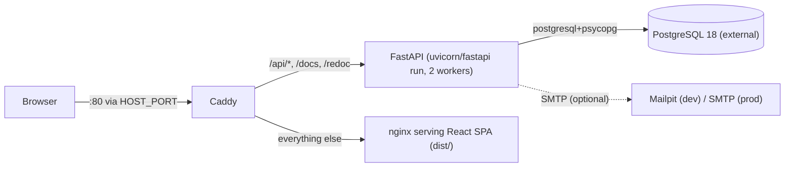

# prata-sys — Onboarding Guide

> A business-management system for a **water-well drilling company** in Brazil. Manages clients,
> service orders, inventory (estoque), quotes (orçamentos), suppliers (fornecedores), and finance.
> Built on the [FastAPI Full-Stack Template](https://github.com/fastapi/full-stack-fastapi-template).
>
> This guide is grounded in the code as of the `fix/rotation-runbook-hash-safe` branch. Every factual
> claim cites `path:line`. Sections 8–10 mark opinions explicitly. Target read time: ~20 min.

---

## 1. TL;DR

- **What it does:** manages the full lifecycle of a drilling business — clients (CPF/CNPJ), service
  orders with a status machine and stock reservation, an inventory subsystem with FIFO reservation
  under row locks, quotes that convert to services, supplier records, and a finance ledger with a
  dashboard.
- **Stack:** Python 3.14 + FastAPI + SQLModel + PostgreSQL + Alembic (backend); React 19 + TypeScript +
  Vite + TanStack Router/Query + Tailwind v4 + shadcn/ui (frontend). `uv` for Python, `bun` for JS.
- **Backend layout is deliberately flat:** *all* ORM+schema models live in `backend/app/models.py`,
  *all* DB logic in `backend/app/crud.py`, one router per resource under `backend/app/api/routes/`
  (`backend/CLAUDE.md`).
- **Frontend never hand-writes API calls:** the client in `frontend/src/client/` is auto-generated
  from the backend's OpenAPI spec via `@hey-api/openapi-ts` (`frontend/src/client/index.ts:1`). The
  client uses native `fetch` — axios was dropped (PR #120).
- **Run it locally:** `bash scripts/dev-setup.sh` once, then backend `uv run fastapi dev app/main.py`
  (`:8000`) and frontend `bun run dev` (`:5173`). Postgres + Mailpit come from `compose.dev.yml`.
- **Auth & RBAC:** JWT (HS256) + a two-tier permission model — role defaults ∪ per-user DB overrides,
  cached per request (`backend/app/api/deps.py:63-94`). Roles: `admin`, `finance`, `client`.
- **Ships via GitHub Actions:** merge to `main` → test → build images to GHCR → pull-based deploy over
  Tailscale to a single Docker host (`.github/workflows/deploy.yml`).
- **Where to start reading:** `backend/app/models.py`, `backend/app/crud.py` (stock logic
  `crud.py:368-443`), `backend/app/api/deps.py` (auth/RBAC), `frontend/src/main.tsx` (app wiring),
  `frontend/src/routes/_layout.tsx` (auth guard).

---

## 2. Architecture overview

### Runtime picture



- **Reverse proxy:** Caddy listens on `:80` inside its container; `@backend path /api/* /docs /redoc`
  → `backend:8000`, everything else → `frontend:80` (`Caddyfile:9-20`). Only Caddy publishes a host
  port in prod (`compose.prod.yml:65-66`). No TLS is configured in the Caddyfile today — it serves
  plain `:80` (TLS is noted as future work in `deploy/README.md`).
- **Frontend** is a static SPA built by Vite and served by nginx, with `try_files $uri /index.html`
  fallback (`frontend/nginx.conf:4-8`) and a guard returning 404 for `/api`, `/docs`, `/redoc` so
  those never fall through to the SPA (`frontend/nginx-backend-not-found.conf:1-9`).
- **Backend** mounts every router under `settings.API_V1_STR` = `/api/v1` (`backend/app/core/config.py:33`,
  `backend/app/api/main.py`). JWT auth (HS256), Argon2/bcrypt password hashing.
- **Database** is PostgreSQL, reached via `postgresql+psycopg`. In prod it runs *outside* the app
  stack (`compose.prod.yml:1-13`; example at `deploy/postgres.compose.example.yml`).

### End-to-end trace: creating a service order (`POST /api/v1/services/`)

1. **Route** — `create_service` in `backend/app/api/routes/services.py:41-54`
   (`response_model=ServiceRead`, `status_code=201`). It declares the guard
   `_: None = Depends(require_permission("manage_services"))`.
2. **Auth + RBAC** — FastAPI resolves the guard before the handler body.
   `require_permission("manage_services")` (`backend/app/api/deps.py:63-94`) depends on `CurrentUser`
   → `get_current_user` (`deps.py:30-46`) decodes the JWT with `SECRET_KEY`/HS256, loads the `User`,
   and rejects bad/inactive/missing users. Superusers bypass (`deps.py:76-77`); otherwise the
   effective permission set is computed once and cached on `request.state` (`deps.py:81-85`). Missing
   `manage_services` → HTTP 403.
3. **Body validation** — Pydantic validates the `ServiceCreate` body (`models.py:399-401`:
   `type`, `execution_address`, optional `notes`, `client_id`).
4. **Handler** — looks up the client via `session.get(Client, ...)`, 404s if absent, then calls
   `crud.create_service(...)` (`services.py:49-54`).
5. **CRUD** — `create_service` (`backend/app/crud.py:278-287`): `Service.model_validate` → `add` →
   `commit` → `refresh`, then re-fetches via `get_service` (`crud.py:240-252`) which eager-loads
   `client`, `items`, `status_logs` with `selectinload` to avoid N+1 at serialization.
6. **Model/DB** — inserts into table `service` (`models.py:456-483`): `status` defaults to
   `ServiceStatus.requested` (`models.py:334`, `348-354`), `created_at` via `get_datetime_utc()`. No
   status log is written at creation (logs are only written on transitions); no stock is reserved yet
   (reservation happens on `→ scheduled`).
7. **Response** — the ORM object is serialized through `ServiceRead` (`models.py:420-433`) and returned
   as HTTP 201.

---

## 3. Repository map

```
prata-sys/
├── backend/
│   └── app/
│       ├── models.py           # ALL SQLModel tables + Pydantic schemas + enums + transition maps
│       ├── crud.py             # ALL DB logic (auth, stock, transitions, dashboards)
│       ├── main.py             # FastAPI app, Sentry, slowapi wiring, router registration
│       ├── api/
│       │   ├── main.py         # mounts every router under /api/v1
│       │   ├── deps.py         # get_db (SessionDep), get_current_user, require_permission()
│       │   └── routes/         # one file per resource (services.py, clients.py, orcamentos.py, …)
│       ├── core/
│       │   ├── config.py       # pydantic-settings Settings (reads ../.env)
│       │   ├── security.py     # JWT + Argon2/bcrypt (PasswordHash)
│       │   ├── db.py           # engine + init_db superuser seed
│       │   ├── permissions.py  # ALL_PERMISSIONS, ROLE_PERMISSIONS, get_effective_permissions
│       │   └── limiter.py      # shared slowapi limiter (enabled only in prod)
│       ├── alembic/versions/   # 21 linear migrations
│       └── tests/              # pytest: api/routes/, crud/, conftest.py, factories.py
│       └── scripts/            # prestart.sh, test.sh, lint.sh, format.sh
├── frontend/
│   └── src/
│       ├── main.tsx            # app entry: OpenAPI base/token, QueryClient, RouterProvider, theme
│       ├── routes/             # file-based TanStack routes (see §5); _layout.tsx = auth guard
│       ├── client/             # AUTO-GENERATED OpenAPI client — never hand-edit
│       ├── components/         # ui/ (shadcn primitives) + feature folders (Services/, Clients/, …)
│       ├── hooks/              # useAuth, useCustomToast, useMobile, useCopyToClipboard
│       └── routeTree.gen.ts    # generated route tree
├── scripts/                    # dev-setup.sh, generate-client.sh, run-tests-if-db-up.sh
├── deploy/                     # README.md (runbook), .env.example, SECRET_ROTATION.md, pg example
├── openspec/                   # spec-driven-development artifacts (config.yaml, changes/, specs/)
├── compose.dev.yml             # local infra only: Postgres + Mailpit
├── compose.prod.yml            # prod stack: backend + frontend + caddy (images pulled from GHCR)
├── Caddyfile                   # reverse proxy config
└── .github/workflows/          # deploy.yml, test-backend.yml, playwright.yml, labeler.yml, …
```

**Conventions (from `backend/CLAUDE.md` and `frontend/CLAUDE.md`):** models in `models.py`, CRUD in
`crud.py`, routers in `api/routes/`; always use `selectinload`/`joinedload` for relationships; return
Pydantic schemas, never raw ORM objects; frontend imports `XService` from `@/client` and never
hand-writes calls; shadcn `components/ui/*` are marked "do not edit directly".

---

## 4. Data model & core domain

All table models use a UUID PK (`Field(default_factory=uuid.uuid4, primary_key=True)`), except the
`CompanySettings` singleton (integer id, defaults to 1). Timestamps use the UTC helper
`get_datetime_utc()` (`models.py:13`).

### Entities & relationships

| Entity | Table | Key relationships |
|---|---|---|
| `User` | `user` | `user_permissions` → `UserPermission` (cascade delete). Role default `admin` (`models.py:60-70`). |
| `UserPermission` | `user_permission` | FK `user_id` (CASCADE), unique `(user_id, permission)` (`models.py:80-88`). |
| `Client` | `client` | unique `document_number`; structured address (`bairro`, `city`, `state`, `cep`) (`models.py:301-311`). |
| `Service` | `service` | FK `client_id`; `items` → `ServiceItem` (cascade), `status_logs` → `ServiceStatusLog`, `product_items` → `ProductItem` (`models.py:456-483`). |
| `ServiceItem` | `serviceitem` | optional FK `product_id` (SET NULL); setting it enables product-scoped stock reservation (`models.py:376-385`). |
| `ProductType` → `Product` → `ProductItem` | `producttype`/`product`/`productitem` | `Product` FK `product_type_id` (RESTRICT) + optional `fornecedor_id`; `ProductItem` is the physical stock unit (`models.py:873-950`). |
| `Fornecedor` | `fornecedor` | `contatos`, `categorias` (both cascade), `transacoes` (`models.py:812-853`). |
| `Transacao` | `transacao` | nullable FKs `service_id`/`client_id`/`fornecedor_id` (SET NULL); `valor` `Numeric(12,2)` (`models.py:704-733`). |
| `Orcamento` | `orcamento` | unique `ref_code`, FK `client_id`, FK `service_id` (set on conversion), `items`/`status_logs`, `created_by_user` (`models.py:1228-1268`). |
| `CompanySettings` | `company_settings` | singleton letterhead for orçamento documents (`models.py:117-129`). |

### Enums & status lifecycles

- **Service** — `ServiceStatus`: `requested → scheduled → executing → completed`, and any non-terminal
  → `cancelled`. Enforced by `VALID_STATUS_TRANSITIONS` (`models.py:348-354`, verified).
- **Stock** — `ProductItemStatus`: `em_estoque → reservado → utilizado` (`models.py:867-870`).
  Forward transitions are validated in `crud.validate_product_item_transition`
  (`crud.py:1082-1091`); the cancel-release path `reservado → em_estoque` bypasses that helper and is
  handled directly in `_release_stock_items` (`crud.py:353-365`).
- **Orçamento** — `OrcamentoStatus`: `rascunho ⇄ em_analise`, `em_analise → aprovado`,
  `aprovado ⇄ em_analise`, any non-terminal → `cancelado` (`models.py:1091-1100`).
- **Transaction** — `TipoTransacao` (`receita`/`despesa`) + `CategoriaTransacao` (12 categories,
  `models.py:551-570`).

### Important invariants

- **Stock reservation is best-effort/FIFO** (see §5) — a shortfall produces a `StockWarning` but does
  **not** block the transition (`crud.py:371-373`).
- **Transaction category must match tipo**, and `client_id` is only allowed on a `receita`; enforced by
  the `TransacaoCreate` validator against `INCOME_CATEGORIES`/`EXPENSE_CATEGORIES` frozensets
  (`models.py:573-593`, `633-659`). `tipo` is immutable on update (`models.py:663`).
- **CNPJ is validated with the July-2026 alphanumeric rule** (ASCII-48 + mod-11 check digits),
  CPF must be 11 digits (`models.py:184-236`, `239-250`).
- **Password reset tokens are single-use** within the expiry window, tracked in
  `used_password_reset_token` (`models.py:152-162`).

The migration history (`backend/app/alembic/versions/`, 21 files, single linear chain) shows the
schema's evolution: an early int→UUID migration, dropping the template's generic "item" table and
adding `role`, then clients, services + status logs, permissions, transacoes, fornecedores, the
estoque tables, and finally orçamentos + company settings. Indexes were added deliberately for hot
paths (e.g. `productitem.status`, `service.client_id`, `service.status`, `service.type`).

---

## 5. Key subsystems

**RBAC.** Two-tier model in `backend/app/core/permissions.py`: effective permissions =
`ROLE_PERMISSIONS` defaults (`permissions.py:48-75`) unioned with per-user `UserPermission` overrides,
via `get_effective_permissions` (`permissions.py:83-92`). `ALL_PERMISSIONS` is a 17-entry registry
with PT-BR labels (`permissions.py:26-44`). Guards use the `require_permission(*perms)` factory
(`deps.py:63-94`, verified), which **short-circuits for superusers** and caches the effective set on
`request.state._cached_permissions` so multiple guards on one endpoint hit the DB once. `crud.set_user_permissions`
only persists true overrides (strips role-default redundancy, `crud.py:160-172`). *Gotcha:* `admin`
does **not** get `manage_financeiro`/contas perms by default — finance concerns are the `finance`
role's; `client` has an empty default set.

**Service lifecycle + stock.** `transition_service_status` (`crud.py:446-507`) validates against
`VALID_STATUS_TRANSITIONS`, then: on `→ scheduled` reserves stock, on `→ completed` deducts it, on
`→ cancelled` releases it — writing a `ServiceStatusLog` and committing once. Reservation
`_check_stock_for_service` (`crud.py:368-417`, verified) is the concurrency-critical path: for each
material `ServiceItem` it runs `SELECT ... FOR UPDATE` (`with_for_update()`, `crud.py:393`) ordered by
`created_at` (**FIFO**), flips `em_estoque` items to `reservado`, and stamps `service_id`. If
`product_id` is set it scopes to that product; otherwise it falls back to *all* em_estoque items
(legacy). *Gotcha:* `_deduct_stock_items` (`crud.py:420-443`, verified) validates the
`deduction_items` ids but then marks **all** `reservado` items for the service as `utilizado` — it
ignores the per-item quantities in `deduction_items`. Confirm intended behavior before relying on
partial baixa.

**Quotes (orçamentos).** Full document lifecycle with a unique 6-char `ref_code`
(`_generate_ref_code`, `crud.py:1284+`). `transition_orcamento_status` (`crud.py:1408-1452`) guards
against approving with zero items and against cancelling/un-approving an already-converted orçamento.
`convert_orcamento_to_service` requires `aprovado` status and is one-time (guarded by `service_id`).
Per-item price visibility via `show_unit_price`; letterhead comes from `CompanySettings`.

**Finance.** `Transacao` CRUD plus a dashboard: `get_yearly_operational_summary`
(`crud.py:1603-1697`) runs three grouped aggregation queries by ISO week (completed-service counts by
type, drilling meters = SUM of perfuração item quantities, weekly profit = receitas − despesas).
Frontend renders KPI cards + a 6-month chart.

**Rate limiting.** A shared slowapi `limiter` (`core/limiter.py`) is wired in `main.py` and **only
enabled in production** (`limiter.py:15-19`). Only the login endpoint is decorated: `5/minute`
(`routes/login.py:27`).

---

## 6. Local development

Local dev runs the app **natively** (no Docker for backend/frontend); Docker only provides Postgres +
Mailpit. Full guide: `development.md`.

**First-time setup** (`scripts/dev-setup.sh:1-66` — idempotent): validates `.env`/`compose.dev.yml`/
docker, boots dev infra, `uv sync --frozen`, runs `prestart.sh` (migrations + superuser seed),
`bun install --frozen-lockfile`.

```bash
# one-time
cp .env.example .env        # local secrets may stay "changethis" (app only warns)
bash scripts/dev-setup.sh

# daily (two terminals)
cd backend && uv run fastapi dev app/main.py      # http://localhost:8000  (docs: /docs)
cd frontend && bun run dev                         # http://localhost:5173

# infra lifecycle
docker compose -f compose.dev.yml up -d --wait     # Postgres :5432 + Mailpit :8025
```

**Tests:**
```bash
cd backend && bash scripts/test.sh        # pytest -n auto + coverage (term-missing + html)
cd frontend && bun run test               # Playwright E2E (Chromium only)
```

**Regenerate the API client after any backend API change** (`scripts/generate-client.sh:1-11`):
```bash
bash ./scripts/generate-client.sh         # dumps OpenAPI JSON, runs openapi-ts, then bun run lint
```

**Migrations** (from `backend/`):
```bash
uv run alembic revision --autogenerate -m "description"   # review before applying!
uv run alembic upgrade head
```

**Pre-commit:** the project uses `prek` (a faster pre-commit) — `uv run prek install -f`
(`development.md:94-104`). Hooks: ruff check/format, mypy (needs `sqlmodel`/`pydantic`/`fastapi` in
`additional_dependencies` and `--python-version=3.14`), gitleaks, biome, pytest.

**Local URLs:** Frontend `:5173`, Backend `:8000`, Swagger `:8000/docs`, Mailpit `:8025`.

---

## 7. Deployment & CI/CD

Everything is GitHub Actions; the deploy host only **pulls** images, never builds
(`.github/workflows/deploy.yml`).

**Pipeline (on push to `main`):**
1. **test** — spins up `postgres:18`, installs Python 3.14 + uv, migrates via `prestart.sh`, runs
   `scripts/test.sh` (`deploy.yml:13-58`).
2. **build** — builds backend (`backend/Dockerfile`) and frontend (`frontend/Dockerfile`) images,
   pushes to GHCR tagged both `:latest` and `:sha-<7>` (`deploy.yml:60-110`). Frontend is built with
   an **empty `VITE_API_URL`** so the SPA calls the API same-origin behind Caddy.
3. **deploy** — joins the private mesh via Tailscale, `scp`s only `compose.prod.yml` + `Caddyfile` to
   the host, then over SSH: GHCR login, `sudo env TAG="$TAG" docker compose -f compose.prod.yml pull`
   and `... up -d --wait --remove-orphans` (`deploy.yml:112-166`). Passing `TAG` through `sudo env`
   is what pins the sha — otherwise sudo resets the environment and compose falls back to
   `${TAG:-latest}` (commit `d5c3533`).

**Migrations on deploy:** run at container start — `compose.prod.yml:22` executes
`bash scripts/prestart.sh && fastapi run --workers 2 app/main.py`, so every (re)start waits for the
DB, runs `alembic upgrade head`, and seeds the superuser (idempotent). *Note:* the backend Dockerfile
defaults to 4 workers (`backend/Dockerfile:42`) but prod overrides to 2 for the small host.

**Config & secrets (mechanism only):**
- The host holds a hand-written `.env` (gitignored since commit `6423615`); required prod vars have no
  safe defaults and `compose.prod.yml` enforces several with `${VAR?Variable not set}`. Full list and
  runbook in `deploy/README.md`; `changethis` secrets are **rejected** in prod (`config.py:97-116`).
- GitHub secrets used by the deploy workflow: `TS_OAUTH_CLIENT_ID`, `TS_OAUTH_SECRET`, `DEPLOY_HOST`,
  `DEPLOY_USER`, `DEPLOY_SSH_KEY`, `DEPLOY_PATH`; registry auth uses the built-in `GITHUB_TOKEN`.
  Coverage publishing uses `SMOKESHOW_AUTH_KEY`.
- Secret rotation is documented step-by-step in `deploy/SECRET_ROTATION.md`.

**Other CI:** `test-backend.yml` (coverage gate `--fail-under=95`), `playwright.yml` (4-way sharded
E2E with Postgres + Mailpit), `lint-frontend.yml` (Biome + build typecheck), `labeler.yml` (enforces a
conventional-type PR label), `semantic_title.yml`, `detect-conflicts.yml`, `smokeshow.yml`.

---

## 8. Strengths of the current architecture

*(Evidence-based assessment of what fits this project's scale well.)*

- **Disciplined N+1 avoidance.** `selectinload` is used consistently for related objects, and read
  models are deliberately split so list endpoints don't over-fetch — `get_service` eager-loads
  `status_logs` but `get_services` omits them (`crud.py:258-261`), backed by `ServiceRead` vs
  `ServiceListRead` (`models.py:420-448`). For a small team this prevents the most common perf
  regression without ORM complexity.
- **Concurrency-safe stock reservation.** Using `SELECT ... FOR UPDATE` with FIFO ordering
  (`crud.py:389-394`) is the correct primitive to prevent double-reservation of a physical stock unit
  under concurrent scheduling — a real risk in an inventory system, handled properly.
- **Thin, generated frontend client.** Auto-generating `src/client/` from OpenAPI removes an entire
  class of frontend/backend drift bugs; the rule "never hand-write API calls" is actually followed.
- **Sensible RBAC for the size.** Role defaults + sparse per-user overrides + per-request caching
  (`deps.py:81-85`) gives flexibility without an external policy engine, and the per-request cache
  keeps multi-guard endpoints cheap.
- **Quality gates that match a solo/small team.** A 95% backend coverage floor, sharded Playwright
  E2E, a required PR label, and secret scanning (gitleaks) are enforced in CI — strong guardrails for
  a codebase without a large review pool.
- **Flat model/crud layout is appropriate here.** A single `models.py` + `crud.py` is easy to grep and
  reason about at this scale; the cost (large files) hasn't yet outweighed the navigational benefit.
- **Spec-driven discipline.** OpenSpec artifacts (proposal/design/tasks/specs per change) give a paper
  trail for each phase — unusually good for a project this size.

---

## 9. Weaknesses, risks & tech debt

*(Honest assessment. Each item says why it matters for **this** project.)*

- **No HTTP readiness endpoint (correctness/ops).** The only health route is
  `GET /api/v1/utils/health-check/` returning `True` with **no DB probe** (`routes/utils.py:29-31`).
  The DB-readiness `SELECT 1` lives only in the startup script `backend_pre_start.py`. Caddy's
  `depends_on service_healthy` and the compose healthcheck therefore verify the process is up, not
  that it can serve DB-backed requests — a bad deploy against an unreachable DB could still pass
  liveness.
- **`_deduct_stock_items` ignores per-item quantities (correctness).** It marks *all* reserved items
  for the service `utilizado` regardless of the `deduction_items` payload (`crud.py:434-443`). For a
  drilling company doing partial material baixa this can silently over-consume stock. Verify intent;
  likely a real bug.
- **JWT stored in `localStorage` (security).** Token is read/written from `localStorage`
  (`frontend/src/hooks/useAuth.ts`) — vulnerable to XSS token theft. The httpOnly-cookie migration is
  written up in `docs/adr/httponly-cookie-auth.md` but **deferred**. Matters because a single XSS in
  any dependency exposes sessions. See the broader checklist in
  `docs/security/SECURITY-AUDIT-TODO.md`.
- **Stale FastAPI-template leftovers (DX/docs).** A few still drag on a new contributor:
  `issue-manager.yml` is gated to `github.repository_owner == 'fastapi'` so it never runs here;
  `frontend/tests/items.spec.ts` targets an "Items" page that no longer exists as a route; and page
  titles mix "FastAPI Template" (`login.tsx:47`, `admin.tsx:39`, `settings.tsx:20`) with "Prata Sys".
  (Root `README.md` and `docs/git-worktrees.md` were rewritten in the docs-refresh PR; the OpenSpec
  path in `CLAUDE.md` is now correct.)
- **Test gaps (test-gap).** No direct route tests for `products`/`product_types`/`product_items`
  (only exercised indirectly via `test_estoque.py`); no concurrency test for the `FOR UPDATE`
  reservation race (fixtures are single-connection savepoint-based, so the locking path is never
  validated under contention); rate limiting is never exercised (disabled outside prod); no E2E specs
  for Clients, Orçamentos, or the Permissions matrix; E2E is Chromium-only with no unit/component
  tests.
- **Frontend inconsistencies (DX/perf).** Route `beforeLoad` guards re-call `UsersService.readUserMe()`
  even though `_layout.tsx:18` already does — an extra API round-trip per protected navigation. Two
  pagination systems coexist (server-side `PaginationBar` at 20/page vs client-side `DataTable`), both
  used on the admin page. The user model mixes a `role` string with a `permissions[]` array, and some
  guards cast `(user as any).role` (`clients.tsx:39`), suggesting `role` isn't on the generated
  `UserPublic` type — a latent type-safety hole.
- **Single-host deploy, no TLS in-repo (scalability/security).** One Docker host, external Postgres,
  plain `:80` in the `Caddyfile`. Fine for current scale, but there's no horizontal story and TLS is
  assumed to be handled elsewhere — worth confirming with whoever owns the box.

---

## 10. TODO backlog

Prioritized; only code-grounded items. Categories: bug / security / correctness / test-gap / DX /
perf / docs.

| # | Title | Category | Severity | File(s) | Suggested fix |
|---|---|---|---|---|---|
| 1 | Stock deduction ignores per-item quantities | correctness/bug | High | `backend/app/crud.py:420-443` | Deduct only the items/quantities named in `deduction_items` instead of all reserved items; add a test. |
| 2 | Health-check does no DB probe; no readiness endpoint | correctness | High | `backend/app/api/routes/utils.py:29-31` | Add a `/ready` (or extend health-check) that runs `SELECT 1`; point compose healthcheck at it. |
| 3 | JWT in localStorage (XSS exposure) | security | Med | `frontend/src/hooks/useAuth.ts`, `docs/adr/httponly-cookie-auth.md` | Execute the deferred httpOnly-cookie ADR. |
| 4 | ~~`CLAUDE.md` OpenSpec path is wrong~~ ✅ resolved | docs | Med | `CLAUDE.md` (OpenSpec section) | Path is now correct (`openspec/`). |
| 5 | Orphaned `items.spec.ts` targets a removed page | test-gap/DX | Med | `frontend/tests/items.spec.ts` | Delete it, or repoint to `estoque/produtos`. |
| 6 | No E2E specs for Clients / Orçamentos / Permissions | test-gap | Med | `frontend/tests/` | Add spec files for these core pages. |
| 7 | No concurrency test for FOR UPDATE reservation | test-gap | Med | `backend/app/crud.py:368-417`, `backend/tests/crud/` | Add a two-connection test that asserts no double-reservation. |
| 8 | No direct route tests for products/product-types/product-items | test-gap | Med | `backend/tests/api/routes/` | Add dedicated test modules. |
| 9 | Duplicate `readUserMe` in route guards | perf/DX | Low | `frontend/src/routes/_layout/*.tsx` | Read the user from router context instead of re-fetching. |
| 10 | Two pagination systems on admin page | DX | Low | `frontend/src/routes/_layout/admin.tsx`, `components/ui/pagination-bar.tsx`, `components/Common/DataTable.tsx` | Standardize on one pagination model. |
| 11 | ~~Stale README + missing `deployment.md` link~~ ✅ resolved | docs | Low | `README.md` | Rewritten for prata-sys; points to `deploy/README.md`. |
| 12 | ~~`docs/git-worktrees.md` lists foreign (pnpm/nx/jus) hooks~~ ✅ resolved | docs | Low | `docs/git-worktrees.md` | Now lists this repo's `uv sync` / `bun install` hooks. |
| 13 | `issue-manager.yml` gated to `fastapi` owner (inert) | docs/DX | Low | `.github/workflows/issue-manager.yml:23` | Remove the workflow or fix the owner gate. |
| 14 | Mixed "FastAPI Template" vs "Prata Sys" titles | DX | Low | `frontend/src/routes/login.tsx:47`, `admin.tsx:39`, `settings.tsx:20` | Rename to "Prata Sys". |
| 15 | `(user as any).role` cast — `role` likely off `UserPublic` type | DX | Low | `frontend/src/routes/_layout/clients.tsx:39` | Ensure `role` is in the generated type; drop the cast. |
| 16 | Backend Dockerfile 4 workers vs prod 2 | docs | Low | `backend/Dockerfile:42`, `compose.prod.yml:22` | Align or add a comment explaining the override. |

### Paste-ready GitHub issues checklist

- [ ] Stock deduction ignores per-item quantities in `_deduct_stock_items` (`crud.py:420-443`) `severity:high` `correctness`
- [ ] Health-check does no DB probe; add a readiness endpoint (`routes/utils.py:29-31`) `severity:high` `correctness`
- [ ] Migrate JWT from localStorage to httpOnly cookies (`useAuth.ts`, ADR deferred) `severity:med` `security`
- [x] Fix OpenSpec path in `CLAUDE.md` (`backend/openspec/` → `openspec/`) `severity:med` `docs`
- [ ] Remove or repoint orphaned `frontend/tests/items.spec.ts` `severity:med` `test-gap`
- [ ] Add E2E specs for Clients, Orçamentos, and Permissions pages `severity:med` `test-gap`
- [ ] Add a concurrency test for the FOR UPDATE stock reservation race (`crud.py:368-417`) `severity:med` `test-gap`
- [ ] Add direct route tests for products/product-types/product-items `severity:med` `test-gap`
- [ ] Stop re-fetching `readUserMe` in per-route `beforeLoad` guards `severity:low` `perf`
- [ ] Standardize pagination (server `PaginationBar` vs client `DataTable`) on the admin page `severity:low` `DX`
- [x] Rewrite root `README.md` for prata-sys; remove dead `deployment.md` link `severity:low` `docs`
- [x] Fix foreign pnpm/nx/jus hooks in `docs/git-worktrees.md` `severity:low` `docs`
- [ ] Remove/fix inert `issue-manager.yml` (gated to `fastapi` owner) `severity:low` `docs`
- [ ] Rename remaining "FastAPI Template" page titles to "Prata Sys" `severity:low` `DX`
- [ ] Ensure `role` is on the generated `UserPublic` type; drop `(user as any)` cast (`clients.tsx:39`) `severity:low` `DX`
- [ ] Document/align backend worker count (Dockerfile 4 vs prod 2) `severity:low` `docs`

---

## 11. First-week checklist

- [ ] Clone the repo and run `bash scripts/dev-setup.sh`; confirm Postgres + Mailpit come up
      (`docker compose -f compose.dev.yml ps`).
- [ ] Start both servers (`uv run fastapi dev app/main.py`, `bun run dev`); open the frontend at
      `:5173` and Swagger at `:8000/docs`.
- [ ] Log in as the seeded superuser (`FIRST_SUPERUSER` from `.env`) and click through
      Serviços → Estoque → Financeiro → Orçamentos.
- [ ] Read these key files, in order: `backend/app/models.py` (enums + transition maps),
      `backend/app/crud.py:368-507` (stock + transitions), `backend/app/api/deps.py:63-94` (RBAC),
      `frontend/src/main.tsx` (wiring), `frontend/src/routes/_layout.tsx` (auth guard).
- [ ] Run the backend tests (`cd backend && bash scripts/test.sh`) and one Playwright spec
      (`cd frontend && bun run test`); confirm they pass locally.
- [ ] Make a trivial change (e.g. a PT-BR label) and regenerate nothing / or add a backend field and
      run `bash ./scripts/generate-client.sh` to see the client regenerate.
- [ ] Ship a starter PR from the backlog (each is small and well-scoped):
  - [ ] **#4 — fix the OpenSpec path in `CLAUDE.md`** (docs-only, zero risk, teaches the layout).
  - [ ] **#5 — remove/repoint the orphaned `items.spec.ts`** (learn the E2E harness).
  - [ ] **#6 (subset) — add a Clients E2E spec** (learn TanStack routes + Playwright auth fixture).
- [ ] Open the PR with a conventional-type label (e.g. `docs`, `test-gap`→`chore`/`fix`) so
      `labeler.yml` passes; use the `/create-pr` skill.
```

---

*Guide reflects the code at branch `fix/rotation-runbook-hash-safe`. When code moves, cited line
numbers may drift — trust the file, not the number.*
